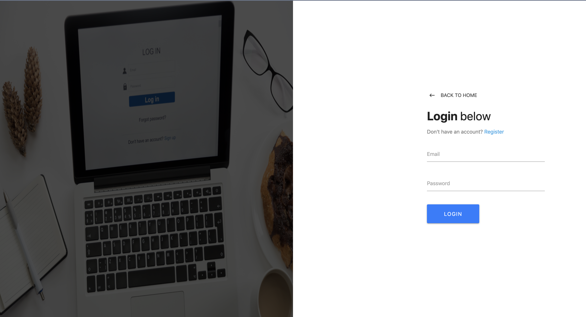

# MERN-authentication-app
I've madee this app using MERN(MongoDB, ExpressJS, ReactJS, NodeJS) and Redux
Pictures from <a href="https://unsplash.com/">unsplash</a>
 
<h3> Dependencies </h3>
   <a href="https://www.npmjs.com/package/concurrently">concurrently</a>
    
   <a href="https://www.npmjs.com/package/bcryptjs">bcryptjs</a>
    
   
   <a href="https://www.npmjs.com/package/body-parser">body-parser</a>
    
   
    <a href="https://www.npmjs.com/package/jsonwebtoken">jsonwebtoken</a>
    
    
   <a href="https://www.npmjs.com/package/passport">passport</a>
    
   
   <a href="https://www.npmjs.com/package/passport-jwt">passport-jwt</a>
    
   
    <a href="https://www.npmjs.com/package/validator">validator</a>
    
    
    <a href="https://www.npmjs.com/package/is-empty">is-empty</a>
    
    

<h3> dev-Dependencies </h3>
    <a href="https://www.npmjs.com/package/nodemon">nodemon</a>

